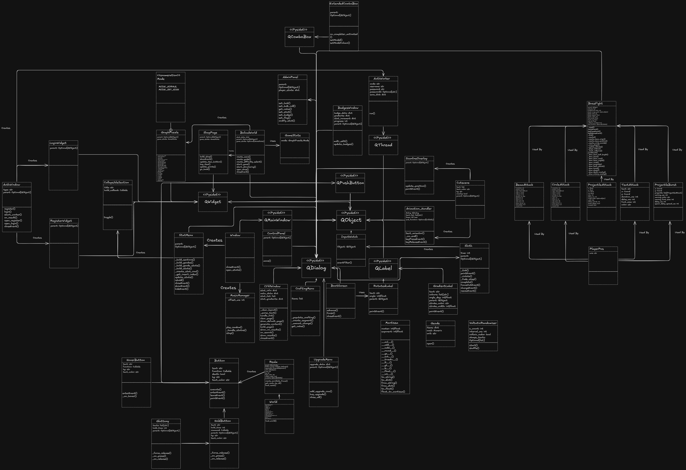

# SOFTWARE ENGINEERING PROJECT DOCUMENTATION TEMPLATE

## RATIONALE

This documentation template is designed to help you complete **Component A - Project Documentation** of your Software Engineering Year 12 Personal Project.

**The template supports the four required stages from the syllabus:**

- Identifying and Defining
- Research and Planning
- Producing and Implementing
- Testing and Evaluating

**It also includes essential modelling tools (which are EXAMINABLE in the HSC!):**

- Context Diagram
- Data Flow Diagrams (DFDs)
- Structure Chart
- IPO Chart
- Data Dictionary
- UML Class Diagram (if OOP)

## TITLE PAGE

**Project Title: Button Simulator: Excavation Discoveries, but bad**  
**Student Name: Anthony Revel**  
**Date: 2/03/2026**  
**Course:** Software Engineering Stage 6  
**GitHub URL (if applicable):**

Table of Contents

[SOFTWARE ENGINEERING PROJECT DOCUMENTATION TEMPLATE 1](#software-engineering-project-documentation-template)

[RATIONALE 1](#rationale)

[TITLE PAGE 2](#title-page)

[Syllabus Requirements 5](#syllabus-requirements)

[1\. Identifying and Defining 7](#1-identifying-and-defining)

[1.1 Problem Statement 7](#11-problem-statement)

[1.2 Project Purpose and Boundaries 7](#12-project-purpose-and-boundaries)

[1.3 Stakeholder Requirements 7](#13-stakeholder-requirements)

[1.4 Functional Requirements 7](#14-functional-requirements)

[1.5 Non-Functional Requirements 7](#15-non-functional-requirements)

[1.6 Constraints 7](#16-constraints)

[1.7 Requirements Analysis and Prioritisation 8](#17-requirements-analysis-and-prioritisation)

[2\. Research and Planning 9](#2-research-and-planning)

[2.1 Development Methodology 9](#21-development-methodology)

[2.2 Tools and Technologies 9](#22-tools-and-technologies)

[2.3 Gantt Chart / Timeline 9](#23-gantt-chart--timeline)

[2.4 Communication Plan 9](#24-communication-plan)

[2.5 Resource Allocation Justification 9](#25-resource-allocation-justification)

[3\. System Design 10](#3-system-design)

[3.1 Context Diagram 10](#31-context-diagram)

[3.2 Data Flow Diagram (Level 1) 10](#32-data-flow-diagram-level-1)

[3.3 Structure Chart 10](#33-structure-chart)

[3.4 IPO Chart 10](#34-ipo-chart)

[3.5 Data Dictionary 10](#35-data-dictionary)

[3.6 UML Class Diagram (if OOP) 10](#36-uml-class-diagram-if-oop)

[4\. Producing and Implementing 11](#4-producing-and-implementing)

[4.1 Development Process 11](#41-development-process)

[4.2 Key Features Developed 11](#42-key-features-developed)

[4.2.1 Back-End Engineering Contribution 11](#421-back-end-engineering-contribution)

[4.3 Screenshots of Interface 11](#43-screenshots-of-interface)

[4.4 Version Control Summary (Optional) 11](#44-version-control-summary-optional)

[5\. Testing and Evaluation 12](#5-testing-and-evaluation)

[5.1 Testing Methods Used 12](#51-testing-methods-used)

[5.2 Test Cases and Results 12](#52-test-cases-and-results)

[5.3 Evaluation Against Requirements 12](#53-evaluation-against-requirements)

[5.4 Improvements and Future Development 12](#54-improvements-and-future-development)

[6\. Feedback, Security and Reflection 13](#6-feedback-security-and-reflection)

[6.1 Summary of Client or Peer Feedback 13](#61-summary-of-client-or-peer-feedback)

[6.2 Secure Software Design and Data Handling 13](#62-secure-software-design-and-data-handling)

[6.3 Personal Reflection 13](#63-personal-reflection)

[7\. Appendices 14](#7-appendices)

## Syllabus Requirements

| **Syllabus Requirement**                                                                  | **Template Section**     | **STATUS**                                 |
|-------------------------------------------------------------------------------------------|--------------------------|--------------------------------------------|
| Identifying problem, feasibility, and requirements                                        | Section 1.1 - 1.6        | Complete     |
| Stakeholder and client expectations and feedback                                          | Section 1.3, Section 6.1 | In Progress  |
| Functional and non-functional requirements                                                | Section 1.4, 1.5         | Complete     |
| Project constraints                                                                       | Section 1.6              | Complete     |
| Planning methodology and Gantt chart                                                      | Section 2.1 - 2.3        | Complete     |
| Tools and language justification                                                          | Section 2.2              | Complete     |
| Communication with clients and feedback loops                                             | Section 2.4, 6.1         | Incomplete |
| Context Diagram and DFDs                                                                  | Section 3.1, 3.2         | Complete     |
| Structure Chart and IPO                                                                   | Section 3.3, 3.4         | Complete     |
| Data Dictionary                                                                           | Section 3.5              | Complete     |
| UML Class Diagram (if applicable)                                                         | Section 3.6              | Complete     |
| Code implementation and key features                                                      | Section 4.1 - 4.2        | Incomplete |
| UI screenshots and explanation                                                            | Section 4.3              | Incomplete |
| Version control and iterations (optional)                                                 | Section 4.4              | Incomplete |
| Testing methods and test cases                                                            | Section 5.1 - 5.2        | Incomplete |
| Evaluation of requirements and software effectiveness                                     | Section 5.3              | Incomplete |
| Suggestions for improvement and future development                                        | Section 6.1 - 6.3        | Incomplete |
| Analyse and respond to feedback,  evaluate the effectiveness of a software solution | Section 6.2              | Incomplete |

# 1\. Identifying and Defining

## 1.1 Problem Statement

It is well known that in the present day many of those in the younger generations suffer from a deficit in their attention spans, leading to lack of motivation. This can lead to difficulty of learning in the classroom as they fail to have the patience and attention required for a long-term reward such as knowledge. an incremental game such as the one being produced creates a sense of progress while performing repetitve and long-term tasks awarding persistence whilst still giving the sense of progression of the short-term and with it being a game rather than a basic progress tracker it can bring more users in, and through entertaining those users they can begin to properly appreciate long-term benefits.

## 1.2 Project Purpose and Boundaries

This project is an attempt to create a faithful recreation of the now deprecated Roblox game [Button Simulator: Excavation Discoveries](https://example.com) in a **GUI** format, recreating the main mechanics of the game and some of its various puzzles with some creative liberties.

## 1.3 Stakeholder Requirements

The stakeholders are primarly the users, a game is made to entertain and engage the user. Considering this is an incremental game it should have reasonable progression, being quick at first and taking longer the deeper the user is into the system, allowing them to slowly adjust to longer times between significant milestones in progress, this requires the game to have proper balancing to ensure that the difficulty curve is gradual enough to avoid being too easy but also to avoid too much difficulty in progression. A game with only one main mechanic repeated ad nauseam fails to be entertaining, hence several mechanics are to be introduced to add some level of variety to the gameplay.

## 1.4 Functional Requirements

- The system must be capable of faithfully recreating the entire main progression from Button Simulator: Excavation Discoveries
- The system must be capable of handling overly large numbers that may surpass the inherent float infinity without issue
- The system must be capable of recreating a vast majority of mechanics from Button Simulator: Excavation Discoveries (although creative liberties may be taken), including but not limited to:
  - Geode buttons
  - Recovery buttons
  - Worlds (Areas with their own progression that may or may not affect the main progression)
  - Subworlds (Worlds that act as bonus challenges rather than standalone progressions, typically inherent a portion of the main progression)
  - Crafting
  - Secret/Exclusive stats (Highly puzzle-based/skill-based stats which can be earnt through alternative means that do not necessarily relate to the main progression, puzzles may expand beyond the direct scope of the system and onto the internet)
  - Cost buttons (buttons which only take a set amount to give a currency)
  - Reset buttons (buttons which reset all stats below a certain stat to give an amount of that stat)
  - Gamepasses (linked to the original game to support the developers)
- The system must be capable of retaining user progress between sessions

## 1.5 Non-Functional Requirements

- The system must be able to load content in under 1 second (excluding the initial boot time)
- The system should be easily usable with clear tutorials for the system's basic mechanics
- The system must be capable of safely handling sensitive user data such as account passwords
- The system should be consistently usable with minimal downtime with proper checks to prevent potential DDOS attacks and similar vulnerabilities.

## 1.6 Constraints

- The project must be completed by Term 2 Week 11
- It is not feasible to create the Roblox physics engine in any regard, nor is it feasible to create the project in Luau with Roblox Studio as it would also infringe upon the copyright that exists for the game on Roblox

## 1.7 Requirements Analysis and Prioritisation

**Analyse** the functional and non-functional requirements. In your analysis, consider:

- which requirements were prioritised and why,
- trade-offs made due to constraints,
- how requirements align with the identified problem or opportunity

# 2\. Research and Planning

## 2.1 Development Methodology

Due to the general nature of the project as a live-service game it is most logical to use the WAgile methodology as early development stages require the linear format of Waterfall whilst the later stagers benefit greatly from user feedback and the iterations of the Agile methodology. Waterfall can be used for the implementations of larger updates that may change fundamental logic whilst Agile is more useful for smaller quality of life changes or bugfixes that come with the live-service aspect of the game.
The project itself is also large and highly complex, but also requires direct response to user feedback, hence it makes sense to use the WAgile methodology as aspects of both the Waterfall and Agile methodologies are required.

## 2.2 Tools and Technologies

Python has been chosen as the primary coding language for the project with the PySide6 library being the project's core component. Python has been chosen due to my own familiarity with the programming language and my general lack of knowledge of any other language. PySide6 has been chosen for various reasons, other GUI modules were tested but were however deemed insufficient for the task at hand. Tkinter and the other various libraries that have been made for it are incapable of handling the aesthetic requirements of the project, cefpython3 was rejected due to the excessive requirement of requiring a downgrade of Python, PySide6 has proven itself capable of meeting the project's aesthetic requirements with its QSS and QPaintEvents allowing for the necessary aesthetics. PySide6's integration with matplotlib, ffmpeg and sql allow for the reduction of requirements through not needing the use of other programming libraries and reduces some of the various limitations that typically come with a GUI program with these useful tools being directly integrated into the library rather than needing further downloads.

## 2.3 Gantt Chart / Timeline

**Explain** how time was allocated to planning, development, testing, and evaluation.

## 2.4 Communication Plan

Client and peer feedback will be obtained through continuous playtesting, with a consistent savefile system between versions transitioning between versions will not be difficult (unless major changes are made, then a program will be given that converts the file for them), through this playtesting feedback will be obtained directly from the clients and my peers and using this feedback new feature can be added or quality of life changes can be made to incoporate their feedback into future versions of the software.

## 2.5 Resource Allocation Justification

**Justify** the resource allocation for the project, including:

- Time
- Software and hardware tools
- Human input (client, peers, teacher feedback)

# 3\. System Design

This section justifies the use of modelling tools to represent system structure, data flow, and processing logic prior to implementation.

## 3.1 Context Diagram

## 3.2 Data Flow Diagram (Level 1)

## 3.3 Structure Chart

## 3.4 IPO Chart

| Input                    | Process                                                                      | Output                      |
|--------------------------|------------------------------------------------------------------------------|-----------------------------|
| Username + Password      | Hash password, validate username and password,  login                  | Login user, or reject login |
| Stat Data + Upgrade Data | Check button type, go through button process, return changed stat data | Stat Data                   |
| User Query               | Search CY47 for query, return results                                     | Results                     |
| User Puzzle Input, Area  | Check area, check input, go through process if input is valid          | Varies (Often Stat Data)    |
| Button Press             | Go through button functionality                                              | Varies                      |
| File Paths               | Load and scale game assets                                                   | Assests displayed           |
| Savefile                 | Loads savefile from json                                                     | Stat Data                   |

## 3.5 Data Dictionary

| Name                  | Data Type          | Size/Format                                                 | Description                                                               | Example Value                                                    | Constraints/Validation Rules                         |
|-----------------------|--------------------|-------------------------------------------------------------|---------------------------------------------------------------------------|------------------------------------------------------------------|------------------------------------------------------|
| stat_info             | Dict               | Length is equal to amount of stats in game                  | Huge dictionary that contains all the information in the game             | {"Cash": {"Multis": None}}                                       | Must be dict                                         |
| stat_gradients        | Dict[dict]         | Length should be equal to amount of stats in game           | Huge dictionary that contains all stat gradients in the game              | {"Cash": {"Colours": {}"#ffffff", "#ffffff"}, "Angle: 90}        | Must be a dict                                       |
| savefile              | JSON               | Contains everything                                         | Stores user savedata allowing for it to be saved between playthroughs     | {"Stats":{"Cash": 1}}                                            | Must be JSON                                         |
| cytherax_data         | Dict               | Length is equal to amount of pages used by CY47             | Huge dictionary containing all the data used by CY47                      | {"Cash": "obtainment": "TBA", "info": "TBA}                      | Must be a dict                                       |
| craftable_stats       | List[str]          | Length is equal to amount of craftable stats                | List containing names of all craftable stats in the game                  | ["Item1", "Item2"]                                               | Must be a list that contains only strings            |
| default_upgrades      | Dict[dict]         | Length equal to amount of upgrades in the game              | Dictionary containg the information about all the upgrades, and the level | {"Upgrade1":{"Cost": 1, "Level": 1, "Growth": 1.1, "Effect": 1}} | Must be a nested dict                                |
| default_keys          | Dict[bool]         | Values must be true or false                                | Dictionary of keys that exist for various reasons                         | {"Key_1": True}                                                  | Values must be boolean                               |
| Icon                  | QIcon              | QIcon                                                       | Application Icon                                                          | QIcon("File/path", QSize(16,16))                                 | Requires minimun of file path and QSize              |
| e_event               | bool               | True or False                                               | Flag for if event power logic is active                                   | True                                                             | Must be boolean                                      |
| reset_key             | str                | str of any length                                           | Reference key for what progression is to be reset                         | "Main Progression"                                               | Must be a key of stat_info                           |
| C=cash_type           | str                | str of any length                                           | What stat acts as cash for a given world                                  | "Cash"                                                           | Must be a key of the nested dicts of stat_info       |
| multi_type            | str                | str of any length                                           | What stat acts as multiplier for a given world                            | "Multiplier"                                                     | Must be a key of the nested dicts of stat_info       |
| rebirth_type          | str                | str of any length                                           | What stat acts as rebirths for a given world                              | "Rebirths"                                                       | Must be a key of the nested dicts of stat_info       |
| gem_type              | str                | str of any length                                           | What stat acts as gems for a given world                                  | "Gems"                                                           | Must be a key of the nested dicts of stat_info       |
| e_type                | str                | str of any length                                           | What stat acts as event power for a given world                           | "Event Power"                                                    | Must be a key of the nested dicts of stat_info       |
| m_logic               | bool               | True or False                                               | Flag to determine if multiplier logic applies in a given world            | True                                                             | Must be a boolean                                    |
| luck                  | int/float          | 0-inf (exlucsive)                                           | Luck boost used by geodes                                                 | 1                                                                | Must not be a Mantissa object                        |
| crit_luck             | int/float          | 0-inf (exclusive)                                           | Luck for critical button presses (double the stat gain)                   | 1                                                                | Must not be a Mantissa object                        |
| geode_speed           | int                | geode_spped <= 1                                            | Forced cooldown time between geode button presses (for testing)           | 1                                                                | Must be int                                          |
| bulk_roll             | int/float          | 0-inf (exclusive)                                           | Amount of geodes opened in one roll                                       | 1                                                                | Must not be Mantissa obect                           |
| voltaic_radar         | bool               | True or False                                               | P2W method to bypass specific mechanic in oen specific area               | True                                                             | Must be boolean                                      |
| FILE_ATTRIBUTE_HIDDEN | "int"              | 0x02 (constant)                                             | File attribute to make hidden                                             | 0x02                                                             | Must be 0x02                                         |
| FILE_ATTRIBUTE_SYSTEM | "int"              | 0x04                                                        | File attribute to make file system-level hidden                           | 0x04                                                             | Must be 0x04                                         |
| InputWatch            | class(QObject)     | Needs object to be watched                                  | System to catch any user input                                            | InputWatch(QObject)                                              | Must have an object to watch                         |
| ExtendedComboBox      | class(QComboBox)   | May need parent, has all requirements of original QComboBox | QComboBox with an autocomplete extension                                  | ExtendedComboBox(data, parent)                                   | Has all requirements of QComboBox                    |
| StatMenu              | QMainWindow        | QNainWindow                                                 | GUI Window containing all stat amounts                                    | StatMenu()                                                       | Has all requirements of QMainWindow                  |
| MusicManager          | class              | object with no attributes                                   | Class that manages the background music loop                              | MusicManager()                                                   | Requires music file paths to be played               |
| Window                | class(QMainWindow) | QMainWindow                                                 | GUI Window                                                                | Window()                                                         | Has all requirements of QMainWindow                  |
| AdminPanel            | class(QDialog)     | QDialog, only parent required                               | Secret dialog window for testing                                          | AdminPanel(parent)                                               | Has all requirements of QDialog                      |
| Sloth                 | class(QDialog)     | QDialog, requires InputWatch                                | Secret window for a secret puzzle                                         | Sloth()                                                          | Has all requirements of QDialog, requires InputWatch |
<!-- Welp, here we go, you asked for this -->

## 3.6 UML Class Diagram (if OOP)

In the off chance that the diagram did not clearly explains to you the full structure of all my classes and their relationships. What can be said is that most of the classes exist in their own bundled groups, such as that of the BossFight class and the many attack data classes, with the creation of one often leading to the creation or usage of others in that same group. All classes return to the Window, as the Window creates the main GUI of the program and hence all functions to create all the other classes come back to it. Almost every class inherents from PySide6's QObject class (or inherents from something else that inherents from the QObject class). A vast majority of the classes are optional, a majority exact solely for minigames or only have one use, hence many lack more specific and useful commands.

# 4\. Producing and Implementing

## 4.1 Development Process

I used a rather iterative but also linear WAgile approach first creating the strictly required structure before constructing the game feature by feature. I began with the creation of the incremental currency increase system and multiplicative logic. I then added: A stat menu, looping background music, an area loading system, rng buttons called "Geodes", the Mantissa system for extremely large numbers, json saving. After those minor changes I improved upon the Mantissa and Geode systems and remade the entire tkinter GUI in PySide6 because tkinter was entirely incapable of handling gradient text no matter how many other modules were used. After this the Boosts/Upgrades system was added as a form of Quality of Life and the 1/500 chance to get double of a stat (officially called getting a "Critical" of it) was added. The Stat Menu was remade and gradient labels were created and overall Mantissa and Geode logic were improved. Subsequently the first puzzle-based Secret Stats were added as well as all the main Realms being added and the first World other than the Main World. The Gradient label system was improved the json savefile system was made to be more efficient and handling for the lack of some required modules was also added. Next many more images were added and the cost and reset button logic was changed to fit the new savefile system. As a result of the relatively casual approach at the time, the next thing I created was a graphing minigame with matplotlib's PySide6 integration and numpy. I also created the first version of Cytherax-47 and a proper World system was created and even more assets were added. The entire repository was then organised and all content that COULD be added was exposed, I added the Crafting system and finally made the ain game fully completeable.

**Justify** the engineering techniques used, such as:

- Modular design
- Object-oriented principles
- Reuse of code
- Validation and error handling

## 4.2 Key Features Developed

**Describe** the core features of the system.

**Justify** their inclusion.

## 4.2.1 Back-End Engineering Contribution

**Explain** how back-end engineering contributed to the success and ease of use of the software, including

- Data processing
- Validation and logic
- Storage and retrieval
- Authentication (if applicable)

## 4.3 Screenshots of Interface

Include annotated screenshots explaining how the user interacts with the system.

## 4.4 Version Control Summary (Optional)

**Summarise** commits, iterations, or sprints if version control was used.

# 5\. Testing and Evaluation

## 5.1 Testing Methods Used

Many testing approaches were used during the creation and evaluation of this software solution, many examples of which can be seen in the 'Tests' folder and if \_\_name_\_ ==  "\_\_main__"
Describe testing approaches, such as:

- Unit testing
- Integration testing
- User testing

**Explain** how testing results were used to improve performance, efficiency, or reliability.

## 5.2 Test Cases and Results

| Test ID | Description                                               | Expected Result                                                         | Actual Result                                                                | Pass/Fail              |
|---------|-----------------------------------------------------------|-------------------------------------------------------------------------|------------------------------------------------------------------------------|------------------------|
| CR01    | Crafting GUI                                              | Loads Crafting GUI                                                      | ScollArea is far too small                                                   | Fail                   |
| CR02    | Crafting GUI                                              | Crafting logic works                                                    | ValueError :D                                                                | Fail                   |
| CY01    | CY47 Page load                                            | Loads pages under new system as intended                                | ValueError                                                                   | Fail                   |
| CY02    | CY47 Page load                                            | Loads pages under new system as intended                                | Pages load as intended                                                       | Pass                   |
| DB00    | Database Load (before inital config)                      | Loads from database as expected                                         | I hate everything (this was several hours of debugging)                      | Fail                   |
| DB00.1  | Database Load (before inital config)                      | Loads from database as expected                                         | Moving db into public did not fix issue                                      | Fail                   |
| DB00.2  | Database Load (before inital config)                      | Loads from database as expected                                         | configuring API settings did not fix issue                                   | Fail                   |
| DB01    | Database Load (after inital config)                       | Loads from database as expected                                         | Succeeds                                                                     | Pass                   |
| DB02    | Database Load (after inital config)                       | Loads from database as expected                                         | SQLAlchemyError, Fails under School Wifi                                     | Fail                   |
| DB02.1  | Database Load (afterinital config)                        | Loads from database as expected                                         | API issue                                                                    | Fail                   |
| DB02.2  | Database Load (afterinital config)                        | Loads from database as expected                                         | Why is my API link not working                                               | Fail                   |
| DB02.3  | Database Load (afterinital config)                        | Loads from database as expected                                         | Why does the supabase module automatically append text to the end of the URL | Fail                   |
| DB03    | Database Load (after inital config)                       | Loads from database as expected                                         | Succeeds under School Wifi                                                   | Pass                   |
| GL01    | Gluttony minigame test                                    | Decreases text by 1 every click, supports grouped strings through lists | Cannot support multiple strings                                              | Fail                   |
| GL01    | Gluttony minigame test                                    | Decreases text by 1 every click, supports grouped strings through lists | Succeeds in both regards                                                     | Fail                   |
| BR01    | Gradient Button                                           | Displays gradient from text                                             | Does not apply to recovery buttons                                           | Fail                   |
| BR02    | Gradient Button                                           | Displays gradient from text                                             | Does not apply to stats that contain text                                    | Fail                   |
| BR03    | Gradient Button                                           | Displays gradient from text                                             | Does not apply to badges                                                     | Fail, but satisfactory |
| CY03    | Whitelist                                                 | Search whitelist works as intended                                      | Whitelist is useless                                                         | Fail                   |
| CY04    | Whitelist                                                 | Search whitelist works as intended                                      | Only whitelisted results appear on search                                    | Pass                   |
| MT01    | Music Offset                                              | Offset music correctly                                                  | Music is not offset on restart                                               | Fail                   |
| MT02    | Music Offset                                              | Offset music correctly                                                  | No music is played                                                           | Fail                   |
| MT03    | Music Offset                                              | Offset music correctly                                                  | Music plays as intended                                                      | Pass                   |
| BF01    | Bossfight Circle Attack debug                             | Create circle attack with accurate hitbox                               | Square hitbox instead of circle                                              | Fail                   |
| BF02    | Bossfight Circle Attack debug                             | Create circle attack with accurate hitbox                               | Circle does not appear                                                       | Fail                   |
| BF03    | Bossfight Circle Attack debug                             | Create circle attack with accurate hitbox                               | Hitbox is everywhere the circle is not                                       | Fail                   |
| BF04    | Bossfight Circle Attack debug                             | Create circle attack with accurate hitbox                               | Circular hitbox and circle created                                           | Pass                   |
| MT04    | Music Offset                                              | Offset music correctly in main program                                  | Music does not play at all                                                   | Fail                   |
| MT05    | Music Offset                                              | Offset music correctly in main program                                  | Music plays as intended                                                      | Pass                   |
| BWR01   | Bolical World Refactor                                    | No change from original functionality                                   | ValueError                                                                   | Fail                   |
| BWR02   | Bolical World Refactor                                    | No change from original functionality                                   | Getting correct graph freezes program                                        | Fail                   |
| BWR03   | Bolical World Refactor                                    | No change from original functionality                                   | Features all work as intended                                                | Pass                   |
| ADT06   | Badge debug                                               | Create option box with badge names                                      | Uses badge id instead of badge name                                          | Fail                   |
| ADT07   | Badge debug                                               | Create option box with badge names                                      | Error, returned None value                                                   | Fail                   |
| ADT08   | Badge debug                                               | Create option box with badge names                                      | KeyError                                                                     | Fail                   |
| ADT09   | Badge debug                                               | Create option box with badge names                                      | Creates option box with badge names                                          | Pass                   |
| ADT10   | Flag debug                                                | Sucessfully sets flag to bool or int value                              | set to int value only                                                        | Fail                   |
| ADT11   | Flag debug                                                | Sucessfully sets flag to bool or int value                              | set to int/bool as expected                                                  | Pass                   |
| BR04    | Welcome back to another 5 minute (hour) coding adventure! | Displays gradient from text                                             | Doesn't work for badges                                                      | Fail                   |
| BR05    | Welcome back to another 5 minute (hour) coding adventure! | Displays gradient from text                                             | Doesn't work for anything                                                    | Fail                   |
| BR06    | Welcome back to another 5 minute (hour) coding adventure! | Displays gradient from text                                             | Works for everything :D                                                      | Pass                   |

## 5.3 Evaluation Against Requirements

**Evaluate** how effectively the solution meets the identified functional and non-functional requirements. Consider your ongoing quality assurance processes.

**Evaluate** your project in terms of how effectively you addressed compliance and legislative requirements (consider privacy, use of data, etc).

## 5.4 Improvements and Future Development

**Outline** your project's limitations.

**Explain** realistic future enhancements.

## 5.5 Evaluation of Social, Ethical and Communication Issues

**Evaluate** your project in terms of

# 6\. Feedback, Security and Reflection

## 6.1 Summary of Client or Peer Feedback

**Summarise** feedback received and explain how it influenced development.

You could collect a **'PMI' (Plus, Minus, Implication)** table from **at least three** different people after testing, or **record and summarise an interview** with **at least three** three people who test the software.

**Evaluate** your use of feedback to improve your project:

- Consider your individual workflow and how well you responded to peer / stakeholder feedback
- Consider how well you involved, empowered or negotiated with a peer/client throughout the process.

## 6.2 Secure Software Design and Data Handling

**Evaluate** the approach undertaken to safely and securely collect, use, and store data.

Your evaluation should address:

- Secure coding practices applied during development
- Input validation and error handling
- Data storage and protection methods
- The impact of secure software design on user trust, data integrity, and system reliability

## 6.3 Personal Reflection

**Reflect** on what you learned during the project, including

- Software engineering skills developed
- Challenges encountered and how they were overcome

# 7\. Appendices

- Full Gantt Chart
- Complete Data Dictionary
- Full Test Logs
- Raw Feedback Notes
- Exemplar Code Snippets
