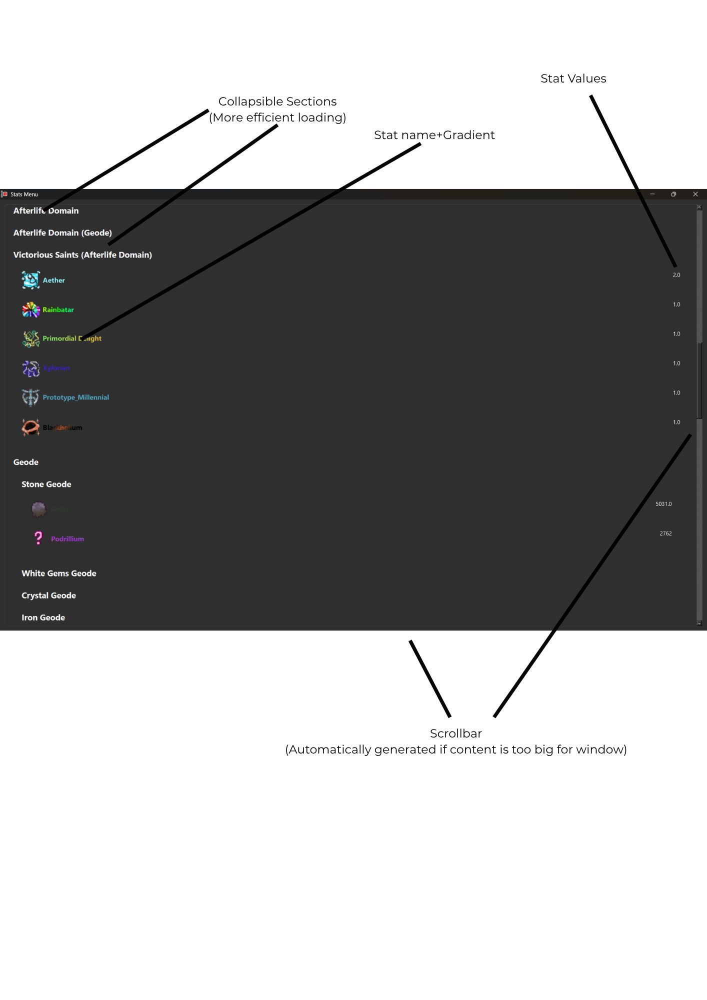

# SOFTWARE ENGINEERING PROJECT DOCUMENTATION

## TITLE PAGE

**Project Title: Button Simulator: Excavation Discoveries, but bad**  
**Student Name: Anthony Revel**  
**Date: 2/03/2026**  
**Course:** Software Engineering Stage 6  
**GitHub URL (if applicable):**

Table of Contents

[SOFTWARE ENGINEERING PROJECT DOCUMENTATION 1](#software-engineering-project-documentation)

[TITLE PAGE 2](#title-page)

[1\. Identifying and Defining 7](#1-identifying-and-defining)

[1.1 Problem Statement 7](#11-problem-statement)

[1.2 Project Purpose and Boundaries 7](#12-project-purpose-and-boundaries)

[1.3 Stakeholder Requirements 7](#13-stakeholder-requirements)

[1.4 Functional Requirements 7](#14-functional-requirements)

[1.5 Non-Functional Requirements 7](#15-non-functional-requirements)

[1.6 Constraints 7](#16-constraints)

[1.7 Requirements Analysis and Prioritisation 8](#17-requirements-analysis-and-prioritisation)

[2\. Research and Planning 9](#2-research-and-planning)

[2.1 Development Methodology 9](#21-development-methodology)

[2.2 Tools and Technologies 9](#22-tools-and-technologies)

[2.3 Gantt Chart / Timeline 9](#23-gantt-chart--timeline)

[2.4 Communication Plan 9](#24-communication-plan)

[2.5 Resource Allocation Justification 9](#25-resource-allocation-justification)

[3\. System Design 10](#3-system-design)

[3.1 Context Diagram 10](#31-context-diagram)

[3.2 Data Flow Diagram (Level 1) 10](#32-data-flow-diagram-level-1)

[3.3 Structure Chart 10](#33-structure-chart)

[3.4 IPO Chart 10](#34-ipo-chart)

[3.5 Data Dictionary 10](#35-data-dictionary)

[3.6 UML Class Diagram (if OOP) 10](#36-uml-class-diagram-if-oop)

[4\. Producing and Implementing 11](#4-producing-and-implementing)

[4.1 Development Process 11](#41-development-process)

[4.2 Key Features Developed 11](#42-key-features-developed)

[4.2.1 Back-End Engineering Contribution 11](#421-back-end-engineering-contribution)

[4.3 Screenshots of Interface 11](#43-screenshots-of-interface)
[4.4 Version Control Summary (Optional) 11](#44-version-control-summary)

[5\. Testing and Evaluation 12](#5-testing-and-evaluation)

[5.1 Testing Methods Used 12](#51-testing-methods-used)

[5.2 Test Cases and Results 12](#52-test-cases-and-results)

[5.3 Evaluation Against Requirements 12](#53-evaluation-against-requirements)

[5.4 Improvements and Future Development 12](#54-improvements-and-future-development)

[6\. Feedback, Security and Reflection 13](#6-feedback-security-and-reflection)

[6.1 Summary of Client or Peer Feedback 13](#61-summary-of-client-or-peer-feedback)

[6.2 Secure Software Design and Data Handling 13](#62-secure-software-design-and-data-handling)

[6.3 Personal Reflection 13](#63-personal-reflection)

[7\. Appendices 14](#7-appendices)

# 1\. Identifying and Defining

## 1.1 Problem Statement

It is well known that in the present day many of those in the younger generations suffer from a deficit in their attention spans, leading to lack of motivation. This can lead to difficulty of learning in the classroom as they fail to have the patience and attention required for a long-term reward such as knowledge. an incremental game such as the one being produced creates a sense of progress while performing repetitve and long-term tasks awarding persistence whilst still giving the sense of progression of the short-term and with it being a game rather than a basic progress tracker it can bring more users in, and through entertaining those users they can begin to properly appreciate long-term benefits.

## 1.2 Project Purpose and Boundaries

This project is an attempt to create a faithful recreation of the now deprecated Roblox game [Button Simulator: Excavation Discoveries](hhttps://www.roblox.com/games/7269094850/Button-Simulator-ED) in a **GUI** format, recreating the main mechanics of the game and some of its various puzzles with some creative liberties.

## 1.3 Stakeholder Requirements

The stakeholders are primarly the users, a game is made to entertain and engage the user. Considering this is an incremental game it should have reasonable progression, being quick at first and taking longer the deeper the user is into the system, allowing them to slowly adjust to longer times between significant milestones in progress, this requires the game to have proper balancing to ensure that the difficulty curve is gradual enough to avoid being too easy but also to avoid too much difficulty in progression. A game with only one main mechanic repeated ad nauseam fails to be entertaining, hence several mechanics are to be introduced to add some level of variety to the gameplay.

## 1.4 Functional Requirements

- The system must be capable of faithfully recreating the entire main progression from Button Simulator: Excavation Discoveries
- The system must be capable of handling overly large numbers that may surpass the inherent float infinity without issue
- The system must be capable of recreating a vast majority of mechanics from Button Simulator: Excavation Discoveries (although creative liberties may be taken), including but not limited to:
  - Geode buttons
  - Recovery buttons
  - Worlds (Areas with their own progression that may or may not affect the main progression)
  - Subworlds (Worlds that act as bonus challenges rather than standalone progressions, typically inherent a portion of the main progression)
  - Crafting
  - Secret/Exclusive stats (Highly puzzle-based/skill-based stats which can be earnt through alternative means that do not necessarily relate to the main progression, puzzles may expand beyond the direct scope of the system and onto the internet)
  - Cost buttons (buttons which only take a set amount to give a currency)
  - Reset buttons (buttons which reset all stats below a certain stat to give an amount of that stat)
  - Gamepasses (linked to the original game to support the developers)
- The system must be capable of retaining user progress between sessions

## 1.5 Non-Functional Requirements

- The system must be able to load content in under 1 second (excluding the initial boot time)
- The system should be easily usable with clear tutorials for the system's basic mechanics
- The system must be capable of safely handling sensitive user data such as account passwords
- The system should be consistently usable with minimal downtime with proper checks to prevent potential DDOS attacks and similar vulnerabilities.

## 1.6 Constraints

- The project must be completed by Term 2 Week 11
- It is not feasible to create the Roblox physics engine in any regard, nor is it feasible to create the project in Lua with Roblox Studio as it would also infringe upon the copyright that exists for the game on Roblox

## 1.7 Requirements Analysis and Prioritisation

- which requirements were prioritised and why,
- trade-offs made due to constraints,
- how requirements align with the identified problem or opportunity
The functional and non-functional requirements range from strict requirements for the game to be even remotely playable to things that really should be done to remain faithful the inspiration of this project.
The need for a savefile system and a way to handle excessively large numbers were prioritised above all else as they are fundamental pillars of the game, without the two systems the program would be extremely limited. After this replication of BS:ED was priortised, beginning with the cost and reset buttton and recovery buttons required for the main progression before focusing on Geode buttons, Crafting and Worlds until the entire Main Progression was completed, and hence the game was completeable. Secret stats and other optional content were only focused on after the implementation of everything else after which all the non-functional requirements were focused on. Subworlds and gamepasses were not implemented due to time constraints and other real-world constraints relating to the status of the original BS:ED.
Although it may not initially be clear how the requirements align with the identified problem, recreating a pre-existing, previously successful game is an effective way to create a successful incremental game as it has already been proven that the game's progression and balancing has previously worked and hence does work to serve to create a high-quality incremental game.

# 2\. Research and Planning

## 2.1 Development Methodology

Due to the general nature of the project as a live-service game it is most logical to use the WAgile methodology as early development stages require the linear format of Waterfall whilst the later stagers benefit greatly from user feedback and the iterations of the Agile methodology. Waterfall can be used for the implementations of larger updates that may change fundamental logic whilst Agile is more useful for smaller quality of life changes or bugfixes that come with the live-service aspect of the game.
The project itself is also large and highly complex, but also requires direct response to user feedback, hence it makes sense to use the WAgile methodology as aspects of both the Waterfall and Agile methodologies are required.

## 2.2 Tools and Technologies

Python has been chosen as the primary coding language for the project with the PySide6 library being the project's core component. Python has been chosen due to my own familiarity with the programming language and my general lack of knowledge of any other language. PySide6 has been chosen for various reasons, other GUI modules were tested but were however deemed insufficient for the task at hand. Tkinter and the other various libraries that have been made for it are incapable of handling the aesthetic requirements of the project, cefpython3 was rejected due to the excessive requirement of requiring a downgrade of Python, PySide6 has proven itself capable of meeting the project's aesthetic requirements with its QSS and QPaintEvents allowing for the necessary aesthetics. PySide6's integration with matplotlib, ffmpeg and sql allow for the reduction of requirements through not needing the use of other programming libraries and reduces some of the various limitations that typically come with a GUI program with these useful tools being directly integrated into the library rather than needing further downloads.

## 2.3 Gantt Chart / Timeline

Time was allocated based on how long each step would realistically take. Although the planning step is important it is quick to pass upon finding and idea and the problem to be solved. Unsurprisingly production and implementation take a vast majority of the time and hence have been assigned a majority of the time. Time for evaluation and reflection were given relatively short times to be done as they do not require too much time to be completed.

## 2.4 Communication Plan

Client and peer feedback will be obtained through continuous playtesting, with a consistent savefile system between versions transitioning between versions will not be difficult (unless major changes are made, then a program will be given that converts the file for them), through this playtesting feedback will be obtained directly from the clients and my peers and using this feedback new feature can be added or quality of life changes can be made to incoporate their feedback into future versions of the software.

## 2.5 Resource Allocation Justification

Large amounts of time were used to make the initial system, including the GUI, the button logic, Realm and World logic, Crafting and all else that is required for the main progression of the game to be completeable, else the project has failed to replicate the main part of the original BS:ED. Visual Studio Code was used for all coding due to my own experience with coding in the application. The PySide6 module was used to create the GUI has it has far less limitations compared to tkinter and can serve to better recreate the original BS:ED, these limitations were realised early into the project development where gradient labels were required but tkinter could not support such no matter how many further modules were utilised. Due to PySide6 being a new module for me, much time is also required to learn the basics of the module and later create more advanced windows with more specific purposes.

# 3\. System Design

## 3.1 Context Diagram

## 3.2 Data Flow Diagram (Level 1)

## 3.3 Structure Chart

## 3.4 IPO Chart

| Input                    | Process                                                                      | Output                      |
|--------------------------|------------------------------------------------------------------------------|-----------------------------|
| Username + Password      | Hash password, validate username and password,  login                  | Login user, or reject login |
| Stat Data + Upgrade Data | Check button type, go through button process, return changed stat data | Stat Data                   |
| User Query               | Search CY47 for query, return results                                     | Results                     |
| User Puzzle Input, Area  | Check area, check input, go through process if input is valid          | Varies (Often Stat Data)    |
| Button Press             | Go through button functionality                                              | Varies                      |
| File Paths               | Load and scale game assets                                                   | Assests displayed           |
| Savefile                 | Loads savefile from json                                                     | Stat Data                   |

## 3.5 Data Dictionary

| Name                  | Data Type          | Size/Format                                                 | Description                                                               | Example Value                                                    | Constraints/Validation Rules                         |
|-----------------------|--------------------|-------------------------------------------------------------|---------------------------------------------------------------------------|------------------------------------------------------------------|------------------------------------------------------|
| stat_info             | Dict               | Length is equal to amount of stats in game                  | Huge dictionary that contains all the information in the game             | {"Cash": {"Multis": None}}                                       | Must be dict                                         |
| stat_gradients        | Dict[dict]         | Length should be equal to amount of stats in game           | Huge dictionary that contains all stat gradients in the game              | {"Cash": {"Colours": {}"#ffffff", "#ffffff"}, "Angle: 90}        | Must be a dict                                       |
| savefile              | JSON               | Contains everything                                         | Stores user savedata allowing for it to be saved between playthroughs     | {"Stats":{"Cash": 1}}                                            | Must be JSON                                         |
| cytherax_data         | Dict               | Length is equal to amount of pages used by CY47             | Huge dictionary containing all the data used by CY47                      | {"Cash": "obtainment": "TBA", "info": "TBA}                      | Must be a dict                                       |
| craftable_stats       | List[str]          | Length is equal to amount of craftable stats                | List containing names of all craftable stats in the game                  | ["Item1", "Item2"]                                               | Must be a list that contains only strings            |
| default_upgrades      | Dict[dict]         | Length equal to amount of upgrades in the game              | Dictionary containg the information about all the upgrades, and the level | {"Upgrade1":{"Cost": 1, "Level": 1, "Growth": 1.1, "Effect": 1}} | Must be a nested dict                                |
| default_keys          | Dict[bool]         | Values must be true or false                                | Dictionary of keys that exist for various reasons                         | {"Key_1": True}                                                  | Values must be boolean                               |
| Icon                  | QIcon              | QIcon                                                       | Application Icon                                                          | QIcon("File/path", QSize(16,16))                                 | Requires minimun of file path and QSize              |
| e_event               | bool               | True or False                                               | Flag for if event power logic is active                                   | True                                                             | Must be boolean                                      |
| reset_key             | str                | str of any length                                           | Reference key for what progression is to be reset                         | "Main Progression"                                               | Must be a key of stat_info                           |
| C=cash_type           | str                | str of any length                                           | What stat acts as cash for a given world                                  | "Cash"                                                           | Must be a key of the nested dicts of stat_info       |
| multi_type            | str                | str of any length                                           | What stat acts as multiplier for a given world                            | "Multiplier"                                                     | Must be a key of the nested dicts of stat_info       |
| rebirth_type          | str                | str of any length                                           | What stat acts as rebirths for a given world                              | "Rebirths"                                                       | Must be a key of the nested dicts of stat_info       |
| gem_type              | str                | str of any length                                           | What stat acts as gems for a given world                                  | "Gems"                                                           | Must be a key of the nested dicts of stat_info       |
| e_type                | str                | str of any length                                           | What stat acts as event power for a given world                           | "Event Power"                                                    | Must be a key of the nested dicts of stat_info       |
| m_logic               | bool               | True or False                                               | Flag to determine if multiplier logic applies in a given world            | True                                                             | Must be a boolean                                    |
| luck                  | int/float          | 0-inf (exlucsive)                                           | Luck boost used by geodes                                                 | 1                                                                | Must not be a Mantissa object                        |
| crit_luck             | int/float          | 0-inf (exclusive)                                           | Luck for critical button presses (double the stat gain)                   | 1                                                                | Must not be a Mantissa object                        |
| geode_speed           | int                | geode_speed <= 1                                            | Forced cooldown time between geode button presses (for testing)           | 1                                                                | Must be int                                          |
| bulk_roll             | int/float          | 0-inf (exclusive)                                           | Amount of geodes opened in one roll                                       | 1                                                                | Must not be Mantissa obect                           |
| voltaic_radar         | bool               | True or False                                               | P2W method to bypass specific mechanic in oen specific area               | True                                                             | Must be boolean                                      |
| FILE_ATTRIBUTE_HIDDEN | "int"              | 0x02 (constant)                                             | File attribute to make hidden                                             | 0x02                                                             | Must be 0x02                                         |
| FILE_ATTRIBUTE_SYSTEM | "int"              | 0x04                                                        | File attribute to make file system-level hidden                           | 0x04                                                             | Must be 0x04                                         |
| InputWatch            | class(QObject)     | Needs object to be watched                                  | System to catch any user input                                            | InputWatch(QObject)                                              | Must have an object to watch                         |
| ExtendedComboBox      | class(QComboBox)   | May need parent, has all requirements of original QComboBox | QComboBox with an autocomplete extension                                  | ExtendedComboBox(data, parent)                                   | Has all requirements of QComboBox                    |
| StatMenu              | QMainWindow        | QNainWindow                                                 | GUI Window containing all stat amounts                                    | StatMenu()                                                       | Has all requirements of QMainWindow                  |
| MusicManager          | class              | object with no attributes                                   | Class that manages the background music loop                              | MusicManager()                                                   | Requires music file paths to be played               |
| Window                | class(QMainWindow) | QMainWindow                                                 | GUI Window                                                                | Window()                                                         | Has all requirements of QMainWindow                  |
| AdminPanel            | class(QDialog)     | QDialog, only parent required                               | Secret dialog window for testing                                          | AdminPanel(parent)                                               | Has all requirements of QDialog                      |
| Sloth                 | class(QDialog)     | QDialog, requires InputWatch                                | Secret window for a secret puzzle                                         | Sloth()                                                          | Has all requirements of QDialog, requires InputWatch |
<!-- Welp, here we go, you asked for this -->

## 3.6 UML Class Diagram (if OOP)

In the off chance that the diagram did not clearly explains to you the full structure of all my classes and their relationships. What can be said is that most of the classes exist in their own bundled groups, such as that of the BossFight class and the many attack data classes, with the creation of one often leading to the creation or usage of others in that same group. All classes return to the Window, as the Window creates the main GUI of the program and hence all functions to create all the other classes come back to it. Almost every class inherents from PySide6's QObject class (or inherents from something else that inherents from the QObject class). A vast majority of the classes are optional, a majority exact solely for minigames or only have one use, hence many lack more specific and useful commands.

# 4\. Producing and Implementing

<!--Do these things seem long? This has been 8 months of work, it's not something that can be summarised to simply-->

## 4.1 Development Process

I used a rather iterative but also linear WAgile approach first creating the strictly required structure before constructing the game feature by feature. This began with the creation of basic logic such as incremental currency increasment and stat multiplier logic before moving onto other features such as the stat menu, background music, realm implementation, a save system and handling of the inevitable extremely large numbers. Along with these I also worked on the aesthetics of the software entirely changing the GUI module used to cater for it and replicated more features from the original BS:ED such as rng-based buttons called 'Geodes', 'Critical' button presses, Upgrades and Crafting. Often I added features off what I felt needed to be balanced from my own playthrough of the game which led to the implementation fo various puzzle-based Secret Stats and eventually the implementations of other Worlds with their own progression. I made various optimisations to reduce load times and added more features such as CY47 to implement otherwise missing information. I later went on to implement the required Secure Software Architecture through the use of an online database, with the API link being hidden and passwords being encrypted with secure session files there is no major risk of data being stolen. With the implementation of the online database I made a proper login and registration system, as well as implementing canonical reasons as to why they are necessary. Finally as a replacement for the skilled-based obbies of the original game I made a bossfight system that can easily be reused for the implementation of other secret stats in future.

Modular design and OOP were both used out of necessity as often objects would require creation and the efficient way to do so without storing countless variables was to create and store object instances, modular design also makes the codebase more readable as having every line of code in one file would make finding the exact location of any given class or function extremely tedious. Code was consistently reused to save time as creating entirely new code for a slightly different task is an extremely inefficient use of time but also copying the exact same code and reusing it in various function is also inefficient as calling a helper function would better suited. Validation and error handling were used to prevent the program from crashing whilst still running, validation ensuring that input is not malformed and error handling managing the cases where validation failed to catch the issue.

## 4.2 Key Features Developed

The systems core features are those of the main incremental game, being the continuous increase logic, the stat multipliers, the systems for the cost and reset buttons and the management of all the separate areas where their buttons are located, all of which are essential to the nature of this project as an incremental game and its effort to replicate the original BS:ED as the game would be entirely dysfunctional without the implementation of such features, or could not be considered a recreation in any regard. Alongside these core features there are recovery buttons, crafting, Worlds and upgrades, all of which are not essential for the main game loop but increase quality of life, properly replicate the original BS:ED and ease the game's otherwise arduous progression.
Amongst the key appeals of the original BS:ED were the secret stats and geode stats, each catering to entirely different audiences. The secret stats add a puzzle-solving and skill-based elements whilst the geode stats catered for those who wish to test their luck in more ethical ways, both always server to ease the game's progression although it can be argued that the game becomes too easy with geode stats. Nevertheless they were in the original BS:ED, hence they have been implemented in its recreation once more catering to those audiences.

## 4.2.1 Back-End Engineering Contribution

Back-end engineering significantly contributed to the success and ease of use of the software. Through back-end engineering an online SQL and local No-SQL system was created ensuring that data was accessible at all times and the software did not strictly require an internet connection to be run. The back-end also deals with user authentication, ensuring the user is indeed who they claim to be whilst also avoiding a login prompt every time the system is rebooted. Through the back-end malformed or missing inputs can be handled allowing for old data to be automatically updated and avoiding any runtime errors from old data being incompatible with new updates as the data is processed to add any missing information and remove any outdated, malformed or redundant bits of data.

## 4.3 Screenshots of Interface

<!-- I don't know what you were expecting here... -->

.png)
.png)
.png)
.png)
.png)
.png)
.png)
.png)
.png)
.png)
.png)
.png)
.png)
.png)
.png)

## 4.4 Version Control Summary

pre-v1.1:
This was the beginning of the project, beginning with the very first, extremely elementary systems before transitioning into more complex systems, it created all the areas from Spawn through to the Obsidian Abyss and created the Mantissa system, the original looping music system with pydub and simpleaudio, the original highly inefficient json save system and the original version of the PySide6 UI, much of which has persisted to the final version.
v1.1:
Upgrades were added, the stat menu was re-added (previously deleted pre v1.1), data began to be marginally better organised and some gradients were added, the areas Colour Temple through to Emperyan Island were added, a cooldown was added to geodes to make them more fair and not so unreasonably powerful.
v1.1.1-v1.2:
The first ever secret stat and the relevant logic was added, the gradient label system was improved, the savefile system was finally improved to be more efficient, MANY more stat icons were added the crit system was implemented, Bolical World was added, Crafting was added, the endgame was made to be completable, Extraterrestrrial orbits was partially revamped, and countless Realms were added to the game alongside a basic World system that avoids the logic required for World Badges. Cytherax-47 was added
v1.2.1-v1.3:
Minor bugfixes were made, the background music system was revamped to use PySide6, all content that could be added to the game was revealed, many minor bits of content were added alongside most of the Moonbase world, World badges were implemented, CY47's functionality was extended to support website-like pages, the stat menu was entirely revamped to massively optimise it and the Realm and World systems were both massively revamped for efficiency.
v1.3.0.1-v1.4:
Very minor aesthetic changes were made alongside the implementation of another secret stat, the database system was created with a full login and registration system and anti-savefile editing alongside further optimisations and the Prelude, creating the first bit of an unfinished story.
v1.4.1-NOW:
Countless bugs were patched, a full bossfight system was added, removed and then re-added, more secret stats were added many segments were given minor refactors and many minor QoL and aesthetic changes were made before the debug menu was improved alongside some better error handling, new discount buttons in Colour Temple (finally) and faster cutscenes.

# 5\. Testing and Evaluation

## 5.1 Testing Methods Used

Testing can be defined as ensuring given functions output the expected result from a given input.
Many testing approaches were used during the creation and evaluation of this software solution, many examples of which can be seen in the 'Tests' folder and under the \_\_name_\_ ==  "\_\_main__" sections of many of the module programs. Unit testing was utilised quite often, testing the individual components or features independently of the main program to isolate errors more easily and filter through the early stages of development for said feature although these do often involve experimenting with the GUI logic as well as the internal logic. Integration testing was a necessity as the test versions of the features often required various alterations to be adapted to the pre-existing architecture of the program and the combination of the new feature with the overall program could lead to various unexpected results as often further logic must be made to account for pre-existing architecture or to ensure the isolated module serves its intended purpose in the full system. User testing was used sparsly due to the difficulty of attaining playtesters. It served to test game balance and to potentially highlight issues that were entirely missed or overlooked. The results of these tests allowed for bugs to be patched faster ensuring the reliability of the software. User testing in particular highlighted any issues with slow loading or unexplained mechanics, allowing for the performance of the software and efficiency of the solution to be improved by responding to user complaints and feedback.

## 5.2 Test Cases and Results

| Test ID | Description                                                                  | Expected Result                                                         | Actual Result                                                                | Pass/Fail              |
|---------|------------------------------------------------------------------------------|-------------------------------------------------------------------------|------------------------------------------------------------------------------|------------------------|
| CR01    | Crafting GUI (unit test)                                                     | Loads Crafting GUI                                                      | ScollArea is far too small                                                   | Fail                   |
| CR02    | Crafting GUI (unit test)                                                     | Crafting logic works                                                    | ValueError :D                                                                | Fail                   |
| CY01    | CY47 Page load (unit test)                                                   | Loads pages under new system as intended                                | ValueError                                                                   | Fail                   |
| CY02    | CY47 Page load (unit test)                                                   | Loads pages under new system as intended                                | Pages load as intended                                                       | Pass                   |
| DB00    | Database Load (before inital config) (unit test)                             | Loads from database as expected                                         | I hate everything (this was several hours of debugging)                      | Fail                   |
| DB00.1  | Database Load (before inital config) (unit test)                             | Loads from database as expected                                         | Moving db into public did not fix issue                                      | Fail                   |
| DB00.2  | Database Load (before inital config) (unit test)                             | Loads from database as expected                                         | configuring API settings did not fix issue                                   | Fail                   |
| DB01    | Database Load (after inital config)  (unit test)                             | Loads from database as expected                                         | Succeeds                                                                     | Pass                   |
| DB02    | Database Load (after inital config) (unit test)                              | Loads from database as expected                                         | SQLAlchemyError, Fails under School Wifi                                     | Fail                   |
| DB02.1  | Database Load (afterinital config) (unit test)                               | Loads from database as expected                                         | API issue                                                                    | Fail                   |
| DB02.2  | Database Load (afterinital config) (unit test)                               | Loads from database as expected                                         | Why is my API link not working                                               | Fail                   |
| DB02.3  | Database Load (afterinital config) (unit test)                               | Loads from database as expected                                         | Why does the supabase module automatically append text to the end of the URL | Fail                   |
| DB03    | Database Load (after inital config) (unit test)                              | Loads from database as expected                                         | Succeeds under School Wifi                                                   | Pass                   |
| GL01    | Gluttony minigame test (unit test)                                           | Decreases text by 1 every click, supports grouped strings through lists | Cannot support multiple strings                                              | Fail                   |
| GL01    | Gluttony minigame test (integration test)                                    | Decreases text by 1 every click, supports grouped strings through lists | Succeeds in both regards                                                     | Fail                   |
| BR01    | Gradient Button (unit test)                                                  | Displays gradient from text                                             | Does not apply to recovery buttons                                           | Fail                   |
| BR02    | Gradient Button (unit test)                                                  | Displays gradient from text                                             | Does not apply to stats that contain text                                    | Fail                   |
| BR03    | Gradient Button (integration test)                                           | Displays gradient from text                                             | Does not apply to badges                                                     | Fail, but satisfactory |
| CY03    | Whitelist (unit test)                                                        | Search whitelist works as intended                                      | Whitelist is useless                                                         | Fail                   |
| CY04    | Whitelist (unit test)                                                        | Search whitelist works as intended                                      | Only whitelisted results appear on search                                    | Pass                   |
| MT01    | Music Offset (unit test)                                                     | Offset music correctly                                                  | Music is not offset on restart                                               | Fail                   |
| MT02    | Music Offset (unit test)                                                     | Offset music correctly                                                  | No music is played                                                           | Fail                   |
| MT03    | Music Offset (unit test)                                                     | Offset music correctly                                                  | Music plays as intended                                                      | Pass                   |
| BF01    | Bossfight Circle Attack debug (unit test)                                    | Create circle attack with accurate hitbox                               | Square hitbox instead of circle                                              | Fail                   |
| BF02    | Bossfight Circle Attack debug (unit test)                                    | Create circle attack with accurate hitbox                               | Circle does not appear                                                       | Fail                   |
| BF03    | Bossfight Circle Attack debug (unit test)                                    | Create circle attack with accurate hitbox                               | Hitbox is everywhere the circle is not                                       | Fail                   |
| BF04    | Bossfight Circle Attack debug (unit test)                                    | Create circle attack with accurate hitbox                               | Circular hitbox and circle created                                           | Pass                   |
| MT04    | Music Offset (integration test)                                              | Offset music correctly in main program                                  | Music does not play at all                                                   | Fail                   |
| MT05    | Music Offset (integration test)                                              | Offset music correctly in main program                                  | Music plays as intended                                                      | Pass                   |
| BWR01   | Bolical World Refactor (unit test)                                           | No change from original functionality                                   | ValueError                                                                   | Fail                   |
| BWR02   | Bolical World Refactor (unit test)                                           | No change from original functionality                                   | Getting correct graph freezes program                                        | Fail                   |
| BWR03   | Bolical World Refactor (unit test)                                           | No change from original functionality                                   | Features all work as intended                                                | Pass                   |
| ADT06   | Badge debug (integration test)                                               | Create option box with badge names                                      | Uses badge id instead of badge name                                          | Fail                   |
| ADT07   | Badge debug (unit test)                                                      | Create option box with badge names                                      | Error, returned None value                                                   | Fail                   |
| ADT08   | Badge debug (unit test)                                                      | Create option box with badge names                                      | KeyError                                                                     | Fail                   |
| ADT09   | Badge debug (integration test)                                               | Create option box with badge names                                      | Creates option box with badge names                                          | Pass                   |
| ADT10   | Flag debug (unit test)                                                       | Sucessfully sets flag to bool or int value                              | set to int value only                                                        | Fail                   |
| ADT11   | Flag debug (unit test)                                                       | Sucessfully sets flag to bool or int value                              | set to int/bool as expected                                                  | Pass                   |
| BR04    | Welcome back to another 5 minute (hour) coding adventure! (unit test)        | Displays gradient from text                                             | Doesn't work for badges                                                      | Fail                   |
| BR05    | Welcome back to another 5 minute (hour) coding adventure! (unit test)        | Displays gradient from text                                             | Doesn't work for anything                                                    | Fail                   |
| BR06    | Welcome back to another 5 minute (hour) coding adventure! (integration test) | Displays gradient from text                                             | Goes for left text first                                                     | Fail                   |
| BR07    | Welcome back to another 5 minute (hour) coding adventure! (integration test) | Displays gradient from text                                             | Doesn't work for scientific notation                                         | Fail                   |
| BR08    | Welcome back to another 5 minute (hour) coding adventure! (integraton test)  | Displays gradient from text                                             | Goes for left text first                                                     | Fail                   |
| BR08    | Welcome back to another 5 minute (hour) coding adventure! (integration test) | Displays gradient from text                                             | Everything works as intended                                                 | Pass                   |

## 5.3 Evaluation Against Requirements

The solution has met almost all of the identified functional non-functional requirements, successfully meeting all requirements other than the implementation of sub-worlds and the proper implementation of gamepasses (which is now impossible due to the version with the gamepasses not being maintained by the developers). It has successfully implemented the FULL Main Progression of BS:ED, it has proper systems to handle numbers beyonf the float infinity, it properly handles cost and reset buttons, it handles the rng of geode buttons in a manner that seems faithful to the original, it handles crafting as intended, it has quick loading times in most regards with an exception to those that depend on a good internet connection. In almost all regards the software has met the functional and non-functional requirements also following legislative requirements with it securely storing passwords and collecting no personally identifiable information. Considering project scope and the time constraints the software solution can be considered to effectively met almost all functional and non-functional requirements.

## 5.4 Improvements and Future Development

The project has various limitations, such a a majority of the cytherax-data being 'TBA', most of the Worlds and Realms directly relying on the BS:ED Wiki's own data, the sheer difficulty of creating original puzzles for secret and exclusive stats whilst still reasonably replicating the original puzzles to some degree and generally any feature or aesthetic improvements require large amounts of work in figuring out entirely new things and using new modules for a singular purpose or extreme amounts of math to figure out how the given example is to be handled, the biggest and most notable flaw is that of the requirement of a .env file to run the program as releasing the database URL creates a massive security vulnerability.

Realistically, future enchancements could include more entries in the cytherax-data, more original Worlds and Realms that do not directly rely on BS:ED and the wiki data. More Bossfights as a general replacements for skill-based challenges of the original game, creating an online API that handles the back-end in the background. The ability to skip cutscenes, more specialised attacks in the boss fights, more puzzles, an account recovery system via email, and of course implementing fully custom events and stats. All of these serve to better the program in different ways, more data simply adds to world building, more original Worlds and Realms allow for what little story that existed in BS:ED to be expanded upon, more bossfights allow for easier implementation of secret stats and allow for skill to be built to justify the difficulty of the harder ones. An account recovery system allows for accounts to not be lost so easily.

The code also needs a massive refactor.
This is non-negotiable.

## 5.5 Evaluation of Social, Ethical and Communication Issues

There are no social or ethical concerns relating to accessibility, there is no content that can be considered epileptic as there are no rapidly flashing lights. There are minor ethical concerns relating to management of data, however there is no personally identifiable information that is stored and passwords a properly hashed, hence there are no ethical concerns relating to the storing of user data. There are minor social concerns relating to the asset usage of the program, however a majority of these assets are under the Creative Commons Attributions License (they were uploaded to the wiki which works under the Creative Commons Attributions Liscense), the real issue exists in the legal concerns. BS:ED and all of its ores (that weren't taken from elsewhere) are owned by a person (even if there is no attributable copyright outside of Roblox), this is an unavoidable issue but the effects against the current owner and the original game can be minimised. This game is not made to make money, it is not made to be a competitor to the original BS:ED, it cannot ever reach the level of the original BS:ED, it is made to be its own standalone program. Due to this, although there are several social, ethical and legal concerns relating to this project, all of them are managable and if not resolved in the current version, due to time constraints, can be resolved in future with future improvements.

# 6\. Feedback, Security and Reflection

## 6.1 Summary of Client or Peer Feedback

Due to everyone being very busy with their own projects, detailed responses were not able to be obtained, hence only summaries of issues could be obtained.

| Person        | Plus                                                                            | Minus                                                                                                            | Implication                                                                                                                        | Other Notes                                    |
|---------------|---------------------------------------------------------------------------------|------------------------------------------------------------------------------------------------------------------|------------------------------------------------------------------------------------------------------------------------------------|------------------------------------------------|
| James Huang   | Sophisticated GUI (specifically being said to be better than his own)           | Unclear how to play without developer guidance, some text is hard to read                                        | Some text colours require changing, a guide should still exist for those who skipped the initial cutscene                          | Did not make it past the tutorial              |
| William Coote | Extremely diverse project with a simple gameplay loop but extensive minigames   | Initally unclear on how to play, some text can be particularly difficult to read                                 | Some text colours require changing, in particular they can be brighter, a clear guide is needed to understand how to play the game | Did not make it past the tutorial              |
| Riley Dowsse  | Extermely cool Ui and gameplay, the simple gameplay has a wide variety of stage | Very challenging to understand without the tutorial and can be high difficulty is you have minimal gaming skills | Its a very cools project that tests your gaming skills, in a simple but creative movement game                                     | I can't play this very well due to poor skills |

The overall feedback relating to minor GUI issues and the lack of clarity without tutorials has been accounted for. Particularly dark colours have been made lighter and there is now a simple TL:DR window for those who skip the initial cutscene which summarises all relevant game mechanics at the given stage of the game.

Peer feedback was not used effectively throughout the development process. The reality was that it was extremely difficult to obtain peer feedback as it would require tens of hours of grinding the game to fully experience the intended progression and make a judgement about it, of which only one person actually bothered to do, who was me. Due to the severe lack of peer/stakeholder feedback it was difficult to guage what needed to be added other than my own considerations for inexperienced players and concerns over balancing from my own playthrough. Although there was someone who had access to a much earlier version of this project for SEVERAL MONTHS no progress was ever made, losing a significant source of potential feedback from a player going in relatively blind. What feedback that was given was responded to relatively well, considering for what was the issue and how to fix it in a simplistic manner, however no client was ever properly involved throughout the entire project, although potential clients do exist in the community of the original BS:ED it is preferable not to stray down that path due to potential copyright issues. Hence, due to the lack of peer/client communication but the relatively effective management of the feedback that could be obtained I believe that feedback was not effectively used to improve the project throughout the development process.

## 6.2 Secure Software Design and Data Handling

The approach this project uses to safely and securely collect, use and store data is highly effective with no concerns relating to the possibility of personally identifiiable information being leaked and only minor concerns relating to other information being leaked. Passwords are hashed, so assuming that access is somehow gained to the database any information obtained would be useless as all passwords are hashed and username/save data information is entirely worthless. Also, to ensure integrity anti-save editing measures are in place. There is consistently input validation and error handling to prevent any data from being leaked due to unexpected errors occuring. Data is stored in an online database with the API link remaining hidden and not pubilically available, and assuming that the API link is found, the only important information, the passwords, are hashed protecting the data and preventing accounts from being stolen. Secure software design ensures that the users can trust the program to keep their information hidden, ensures that data is not malformed and remains accurate and ensures that the system does not run into random unexpected errors, ensuring the reliability of the system hence making the approach highly effective.

## 6.3 Personal Reflection

This is the end.
Or is it ever the end?
This project is the culmnation of my dedication to a game I first played **3 years ago**.
And I'm still not done, I do not know if I will ever be done until true 100% completetion.
But that's not what's relevant here.
So let us see what I learnt through the development of this project.
It is truly impossible to summarise what I learnt. It went from a tkinter project to a PySide6 project with an entire bossfight and graphing minigame to the side. I have learnt countless things relating to the creation of proper GUIs, and of the nature of python as a language, ranging down to the basics of putting outcome if condition else outcome_2 instead of and if else block to using typing to create type unions to make things clearer and full proper time annotations and creating enum classes for efficiency. I've learnt a decent amount of regex, I've even unintentionally learnt the basics of how a search engine functions through the creation of CY47. I have learnt about the seemingly endless capabilities that PySide6 holds, with its paintEvents being more than enough to manually create the logic for games albeit with a lot of maths. I also understand just how bad the class, function and general code management is and how badly the entire program needs a refactor and now I also have a reasonable understanding of how to make an online database. As I said before, it is impossible to truly summarise how much was learnt, this project has persisted on for 8 months and there really seems to be almost nothing that PySide6 can do in terms of GUIs. Countless challenges were encountered, whether they be small code issues or pure gaps in knowledge that cause issues with the current objective of what I wanted to create either resolved through countless hours of searching up solutions or resolved through simply realising that I had made a minor oversight in the creation of the code or just outsourcing, and using that to figure out how the code works before continuing on from there. Once more, it is impossible to quantify all the challenges that were experienced across 8 months, but a good example is that of the creation of the graphing minigame, unsurprisingly when I started I had little to no knowledge of numpy and matplotlib, but I was in France, with endless time and little to no internet connection, it required plently of figuring things out, searching things up, before finally the minigame was made.

# 7\. Appendices

Mclovin had access to the program for at least 4 months and successfully performed 0 hours, 0 minutes and 0 seconds of testing.
No. 1 best playtester.
